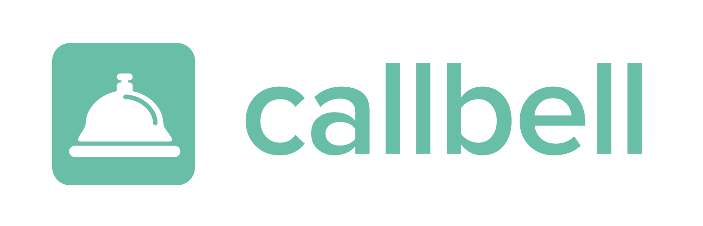

<p align="center"></p>

# Callbell Full Stack Test

## 📦 Installing the project

```
git clone git@github.com:callbellchat/callbell-fullstack-test.git
cd callbell-fullstack-test
yarn install
cp .env.sample .env
bundle install
```

Alternatively, you can [download the source code](https://github.com/callbellchat/callbell-fullstack-test/archive/master.zip) and unzip it.

### Create a Trello account

1. Create a free [Trello](https://trello.com) account if you don't have one already, then visit https://trello.com/app-key to generate credentials.
2. Create a new board `Callbell full stack test`.
3. Open the board, and append `.json` into the URL bar to get the board ID (example: `https://trello.com/b/W6RusfMK/callbell-fullstack-test.json`).
4. Copy the credentials and the board ID into your `.env` file.

### Running the project

You first need to expose your local API so that Trello can send events to your webhooks. For this, run `npx ngrok http 3000` to listen to `localhost:3000`. **Keep that terminal open for the whole test**.
**Also registed this URL into  your `.env` file.**

On another terminal, run your server:

```
bundle exec rails s
```

On another terminal, run your webpack-dev-server:

```
bin/webpack-dev-server
```

The relevant webhook will be registed once ```TrelloWrapper``` is initialized.

Your server will be available at [localhost:3000](http://localhost:3000). Changes made to the code should reload automatically.

**Important note:** if for any reason you have to restart ngrok, the webhooks URL will therefore change, so you'll need to register the webhooks again.

- To run tests: `bundle exec rspec`.

